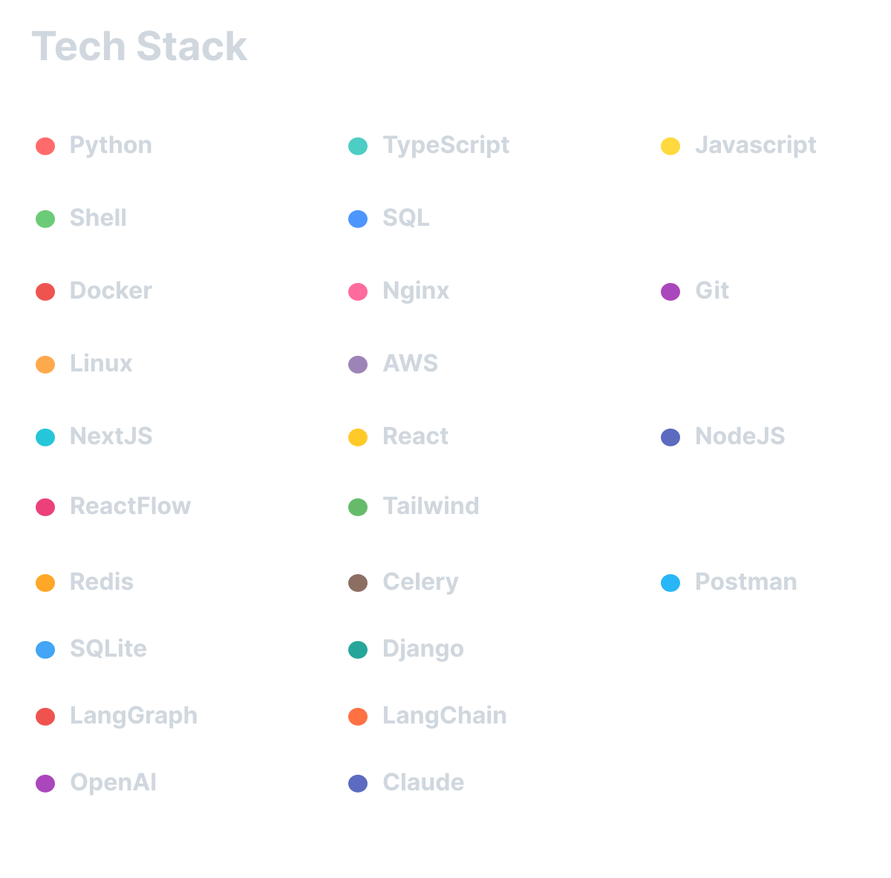

  

<h1 align="center">[Your Name]</h1>

  Full-stack developer building clean web apps, backend systems, and AI-powered workflows.

---

## 🛠 Tech Stack

  

---

## 🤖 AI / Automation

  
  
  
  

---

---

## 🚀 Featured Projects

### 🔹 OBOTO
**NO-CODE** agentic workflow builder through drag and drop!

### 🔹 LEGOEYE
**

---

## 📊 GitHub Stats

  
  

---

## 🔥 Contribution Streak

  

---

## 🌐 Connect With Me

  <a href="https://github.com/your-username">GitHub</a> •
  <a href="https://linkedin.com/in/your-linkedin">LinkedIn</a> •
  <a href="https://yourwebsite.com">Website</a>

  <i>Building useful things, one repo at a time.</i>

